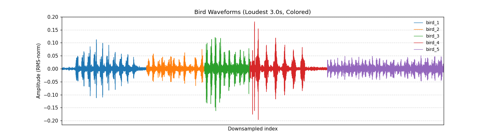
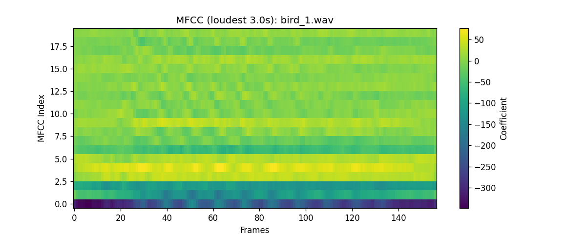
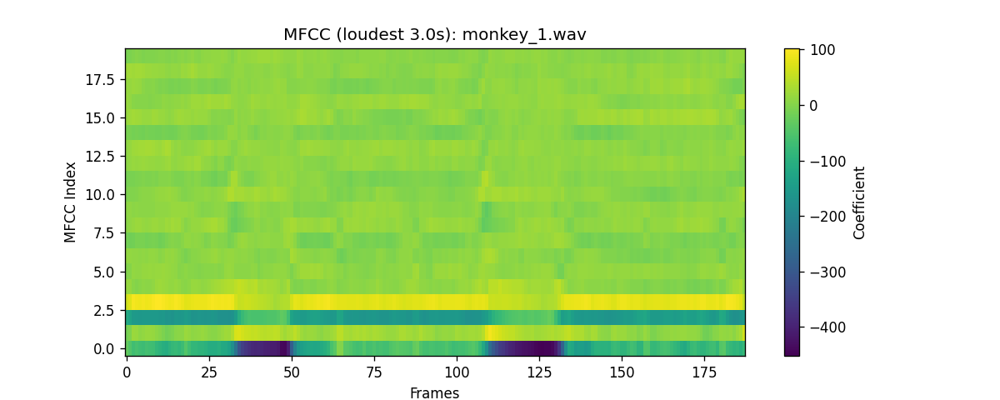
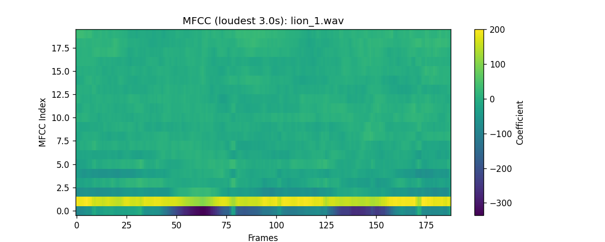

# MFCC Animal Sound Classification

This repository contains a full pipeline for **animal sound classification** using MFCC (Mel Frequency Cepstral Coefficients) features and deep learning models (CNN and LSTM with Attention).

The workflow includes **data preprocessing**, **model training**, **evaluation**, **ONNX export**, and **visualizations** such as waveforms, MFCC plots, confusion matrices, and loss curves.

---

## 📂 Repository Structure

```
.
├── data/                 # Input sound files (animal recordings)
├── results/              # Generated after running the pipeline
│   ├── figures/          # Plots, heatmaps, confusion matrices
│   ├── classes.json      # Class-to-index mapping
│   ├── report.html       # Interactive evaluation report
│   ├── model.onnx        # Exported ONNX model
│   ├── best_model.pt     # Best model checkpoint
│   ├── loss_curve.png    # Training/Validation loss over epochs
│   └── waveforms_plots/  # Concatenated waveform plots
├── scripts/
│   ├── inference.py
│   ├── prepare_data.py
│   └── visualise_results.py
├── src/
│   ├── train.py
│   ├── onnx_processing.py
│   ├── eval.py
│   ├── preprocessing.py
│   └── models/
│       ├── LSTM_Attn.py
│       └── MFCC.py
├── utils/
│   ├── __init__.py
│   ├── utils_audio.py
│   └── utils_plot.py
├── assets.py
├── load.sh
├── requirements.txt
└── README.md
```

---

## 📊 Dataset

For the animal sound clips, we use the dataset from:  
🔗 [Animal Sound Dataset by YashNita](https://github.com/YashNita/Animal-Sound-Dataset/tree/master)

---

## 🚀 How to Run

### 1️⃣ Install dependencies
```bash
pip install -r requirements.txt
```

### 2️⃣ Run with GPU (via SLURM)
```bash
sbatch load.sh
```

This will:
1. Preprocess audio clips into MFCC features
2. Train the model (`mfcc_lstm` or `mfcc_cnn`)
3. Evaluate on the validation set
4. Generate reports & plots in `results/`

---

## 📈 Sample Generated Outputs

### 🔹 Bird Waveforms


### 🔹 MFCC Plots for Bird Samples
<p float="left">
  
  
  
</p>

---

## 📌 Notes
- All generated results are stored in `results/` after running `load.sh`.
- You can switch architectures between `mfcc_lstm` and `mfcc_cnn` in `load.sh`.
- The pipeline supports ONNX export for deployment.

---
