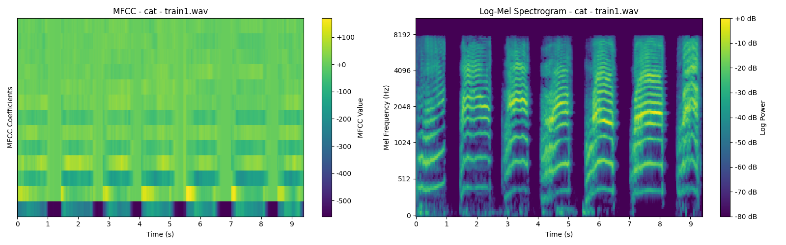
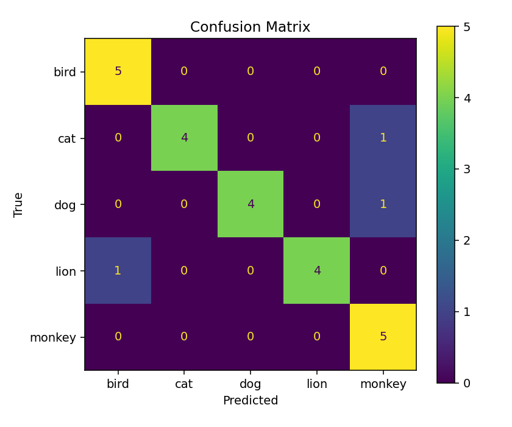
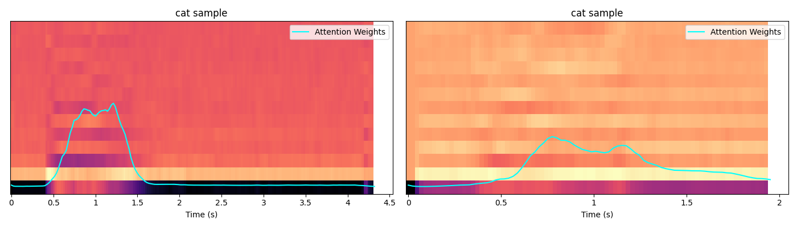
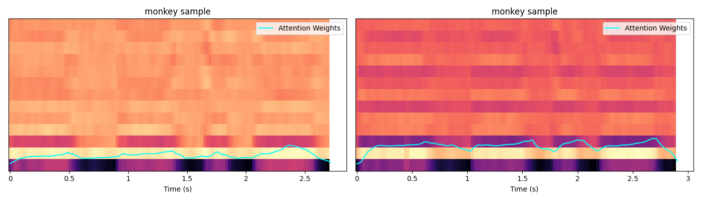
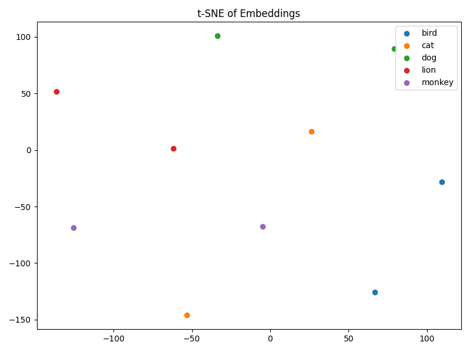
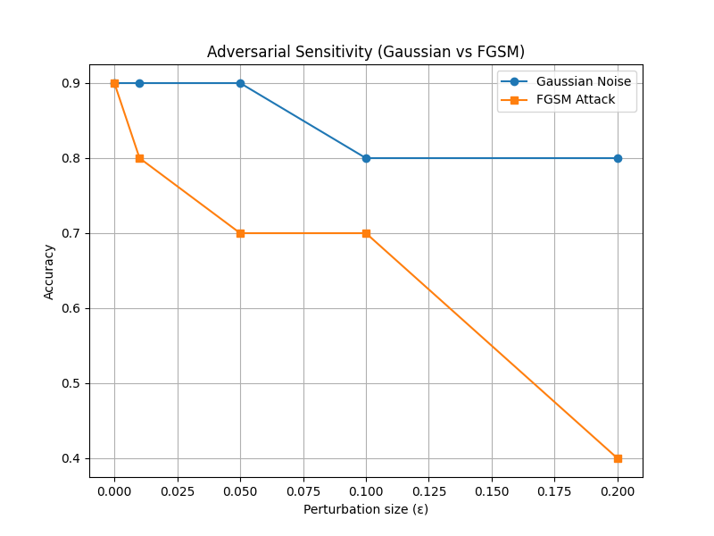

# 🐾 MFCC Animal Sound Classification with OOD Detection and Robustness Analysis  

This project implements a complete pipeline for **animal sound classification** using **MFCC features** and an **LSTM with Attention** model. It also includes **Out-of-Distribution (OOD) detection**, **uncertainty estimation**, **explainability visualizations**, and **robustness testing** against noise and adversarial attacks.  

---

## 📂 Project Structure  

```
data/  
 ├── train/  
 │    ├── bird/ {train1.wav … train5.wav}  
 │    ├── cat/ …  
 │    ├── lion/ …  
 │    ├── monkey/ …  
 │    └── dog/ …  
 └── val/  
      ├── bird/ {val1.wav, val2.wav}  
      ├── cat/ …  
      ├── lion/ …  
      ├── monkey/ …  
      └── dog/ …  

models/  
 ├── LSTM_Attn.py        # Main LSTM + Attention model  
 └── MFCC.py             # MFCC feature extraction dataset class  

results/  
 ├── plots/              # MFCC, log-Mel, and waveform plots  
 ├── explainability/     # Attention visualization plots  
 ├── adversarial_sensitivity.png  
 ├── confusion_matrix.png  
 ├── centroid_distances.png  
 └── logs/experiment.out  

scripts/  
 ├── preprocessing.py    # Data preprocessing (MFCC extraction, etc.)  
 └── onnx_processing.py  # Export model to ONNX format  

src/  
 ├── osr_classifier.py   # OOD detection via centroid distance  
 ├── osr_uncertainty.py  # OOD detection with entropy & MC dropout  
 └── plot_mfcc.py        # MFCC, log-Mel, waveform plotting  

utils/  
 ├── adversarial_sensitivity.py  # Gaussian & FGSM robustness curves  
 ├── confusion_matrix.py         # Confusion matrix plotting  
 ├── embedding_analysis.py       # t-SNE, K-means, logistic regression  
 ├── explainability.py           # Attention visualization plots  
 └── util_centroid.py            # Distance-to-centroid histograms  

assets.py          # Global configs (paths, sample rate, MFCC params)  
train.py           # Training script  
eval.py            # Evaluation script  
run.sh             # SLURM batch job script (sbatch run.sh)  
Requirements.txt   # Python dependencies  
.gitignore  
```

---

## ⚙️ Usage  

### 1. Install dependencies
```bash
pip install -r Requirements.txt
```

### 2. Run the full pipeline on a cluster
Submit the SLURM job:
```bash
sbatch run.sh
```

This script runs:  
- Preprocessing (MFCC extraction, plotting)  
- Model training (`train.py`)  
- Evaluation (`eval.py`)  
- OOD detection (`osr_classifier.py`, `osr_uncertainty.py`)  
- Explainability visualizations (`explainability.py`)  
- Robustness analysis (`adversarial_sensitivity.py`)  

---

## 📊 Results  

### 🔹 Log-Mel Spectogram visualisation for all the samples
  


---

### 🔹 Training & Validation Accuracy  
Validation accuracy ~70% with only **5 training samples per class**, improved with **data augmentation** (noise, pitch shift, stretch).  

---

### 🔹 Confusion Matrix  


Shows per-class misclassifications (e.g., cat vs dog confusion).  

---

### 🔹 Out-of-Distribution Detection  
- **Centroid distance method** separates ID vs OOD (frog sounds).  
- **Uncertainty estimation (entropy)** achieves higher AUC than MC Dropout.  

  

---

### 🔹 Attention Visualization  
The LSTM-Attn model highlights **distinct bursts** (e.g., lion roars, bird chirps) rather than background noise.  





---

### 🔹 Embedding Analysis  
- t-SNE shows clear class separation.  
- K-means clustering aligns with labels.  
- Logistic regression on embeddings improves interpretability.  



---

### 🔹 Adversarial Sensitivity  
- Model is **robust to Gaussian noise**,  
- but **fragile to adversarial FGSM perturbations** (sharp drop in accuracy).  




---

## 📌 Key Contributions  
- End-to-end **audio classification pipeline** with MFCC + LSTM-Attn  
- **OOD detection** using centroids & uncertainty estimation  
- **Explainability** via attention overlays on spectrograms  
- **Robustness analysis** against noise & adversarial attacks  
- **Statistical validation** (ROC, AUC, embeddings, centroid distributions)  


